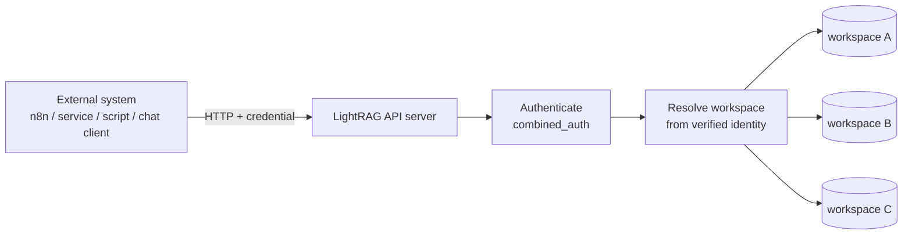
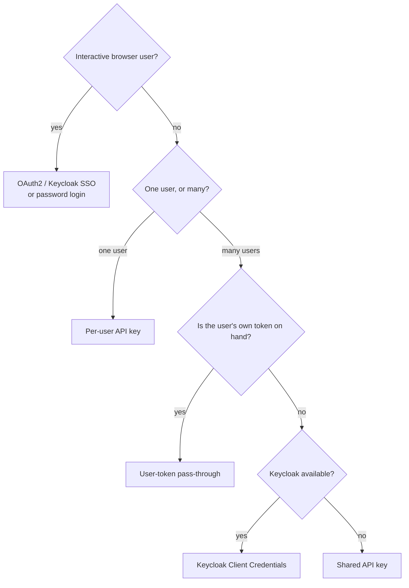

# LightRAG Enterprise Server — Integration Guide

How to integrate external applications, services, and tools — workflow
automation (n8n), backend services, scripts, and chat clients — with the
LightRAG enterprise server (LightRAG 1.5.0, branch `main`).

Covers authentication, multi-tenancy, the REST API, the OpenAI- and
Ollama-compatible APIs, end-to-end integration patterns, security, and error
handling. Examples assume the server at `http://localhost:9621` (default; `PORT`
is configurable). Every endpoint, header, and behaviour here is grounded in the
`main`-branch code.

## Contents

1. [Overview & multi-tenancy model](#1-overview--multi-tenancy-model)
2. [Authentication](#2-authentication)
3. [Multi-tenancy & workspaces](#3-multi-tenancy--workspaces)
4. [Core API](#4-core-api)
5. [OpenAI-compatible API](#5-openai-compatible-api)
6. [Ollama-compatible API](#6-ollama-compatible-api)
7. [Admin API](#7-admin-api)
8. [Integration patterns](#8-integration-patterns)
9. [Security considerations](#9-security-considerations)
10. [Error reference](#10-error-reference)
11. [Configuration reference](#11-configuration-reference)

---

## 1. Overview & multi-tenancy model

An external integration does two things: **ingest** documents into a knowledge
base, and run **inference** (retrieval-augmented queries) against it. Both go
through the same authentication and workspace-resolution layer — a credential
that can ingest into a workspace can also query it, and only it.



### 1.1 The workspace model

- Isolation is enforced at the **workspace** level — each end-user identity is
  bound to exactly one workspace.
- A workspace is a self-contained storage namespace: the knowledge graph,
  vector store, KV store, and doc-status store are all partitioned per workspace.
- The workspace for a request is **derived by the server** from the caller's
  verified identity. A normal user cannot choose or guess another workspace.
- Only admins and allow-listed service accounts may act on another workspace,
  via the `X-Target-Workspace` header (§3).

### 1.2 Two conditions for real isolation

Workspace isolation is only active when **both** conditions hold. With either
missing, all callers share one data set.

| Server state | Behaviour | Isolation |
|---|---|---|
| `ENABLE_MULTI_TENANCY=false` | One shared `LightRAG` instance for the whole server | **None** |
| Multi-tenancy on, but **auth not configured** (`AUTH_ACCOUNTS` unset *and* OAuth2 unconfigured) | Every caller is the `guest` user → `guest` workspace | **None** |
| `ENABLE_MULTI_TENANCY=true` **and** auth configured | Per-identity workspace, resolved by the server | **Full** |

On `main`, `ENABLE_MULTI_TENANCY` and `OAUTH2_ENABLED` both default
to **`true`** — so isolation is active once you supply real Keycloak
credentials (or set `AUTH_ACCOUNTS`). See §11.

---

## 2. Authentication

### 2.1 Choosing a method



| Method | Credential | Workspace selection | Best for |
|---|---|---|---|
| OAuth2 SSO | `Authorization: Bearer <jwt>` (or cookie) | from identity | interactive browser users |
| Password → JWT | `Authorization: Bearer <jwt>` | from identity | interactive users, SSO off |
| Per-user API key | `Authorization: Bearer sk-lightrag-…` | **embedded in the key** | one integration ↔ one user |
| Keycloak Client Credentials | `Authorization: Bearer <service token>` | `X-Target-Workspace` (OBO-gated) | one backend serving many users — **recommended** |
| Shared API key | `X-API-Key: <secret>` | `X-Target-Workspace` (OBO-gated) | trusted internal service, no Keycloak |
| User-token pass-through | `Authorization: Bearer <user token>` | from identity | user-initiated inference; strongest isolation |

### 2.2 Username / password → JWT

```bash
curl -X POST http://localhost:9621/login -d "username=alice&password=secret"
```
Request is `application/x-www-form-urlencoded` (`username`, `password`).
Response: `{ access_token, token_type:"bearer", auth_mode:"enabled", role,
core_version, api_version, … }`. Use `Authorization: Bearer <access_token>`.
Wrong credentials → **401**. Accounts come from `AUTH_ACCOUNTS`; if it is unset,
auth is disabled and a guest token is issued.

### 2.3 OAuth2 / Keycloak SSO

Enabled by default (`OAUTH2_ENABLED=true`).

1. `GET /oauth2/authorize` → `{ authorization_url, state }` (server builds a
   PKCE challenge bound to `state`, 10-minute TTL).
2. Redirect the user to `authorization_url`; they authenticate at Keycloak.
3. Keycloak redirects back to `OAUTH2_REDIRECT_URI` with `?code=…&state=…`:
   - `GET /oauth2/callback` (WebUI) — exchanges the code, sets cookies
     (`lightrag_token` HTTP-only; `lightrag_user` readable metadata), 302s into
     the WebUI.
   - `GET /api/oauth2/callback` (REST clients) — returns JSON
     `{ access_token, token_type, auth_mode:"sso", role, username, … }`.

SSO username = Keycloak `email` (fallback `preferred_username`, `sub`); `role`
is `admin` only if that username is in `ADMIN_ACCOUNTS`. If OAuth2 is enabled
but `OAUTH2_CLIENT_ID`/`OAUTH2_CLIENT_SECRET` are unset, `/oauth2/authorize`
returns **503**. Deep dive: [OAuth2-SSO-Authentication.md](./OAuth2-SSO-Authentication.md).

### 2.4 Keycloak Client Credentials (service accounts)

The **recommended** method for a multi-tenant backend (e.g. n8n routing many
users into their own workspaces).

**In Keycloak** — create a service-account client:
- Create a client, e.g. `n8n-service`.
- **Client authentication: ON** (confidential client).
- Enable **Service accounts roles** (this activates the client-credentials grant).
- Disable **Standard flow** (authorization code) — not needed.
- Record the **client ID** and **client secret**.

(See [KEYCLOAK_SSO_SETUP.md](./KEYCLOAK_SSO_SETUP.md) for realm setup.)

**Obtain a token** directly from Keycloak, then call LightRAG:
```bash
TOKEN=$(curl -s -X POST \
  https://keycloak.example.com/realms/your-realm/protocol/openid-connect/token \
  -d grant_type=client_credentials \
  -d client_id=n8n-service -d client_secret=… | jq -r .access_token)
```
LightRAG validates the token via JWKS and treats it as an **admin service
account**. A service account has no personal workspace, so it **must** send
`X-Target-Workspace` on every workspace operation (§3), and the client must be
in the OBO allowlist (§3.4).

### 2.5 Per-user API keys

A long-lived LightRAG-native credential, `sk-lightrag-{workspace_hash}-{random}`.
The workspace is **encoded in the key**, so it can never reach another workspace
and needs no `X-Target-Workspace` header.

Mint one (requires an existing user token; service accounts are rejected **403**):
```bash
curl -X POST http://localhost:9621/api-keys \
  -H "Authorization: Bearer <user-jwt>" -H "Content-Type: application/json" \
  -d '{"name": "n8n integration", "expires_in_days": 30}'
```
`CreateApiKeyRequest`: `name` (str, required), `expires_in_days` (int,
optional — omit for a non-expiring key). The full key is returned **once**:
```json
{ "api_key": "sk-lightrag-7f3a9c2e-…", "id": "key_a1b2c3d4…",
  "name": "n8n integration", "created_at": "…", "expires_at": null }
```
The server stores only a SHA-256 hash — copy it immediately. Use it like any
Bearer token; manage with `GET /api-keys` (list) and `DELETE /api-keys/{id}`.

### 2.6 Shared API key

A single server-wide secret (`LIGHTRAG_API_KEY`), sent as **`X-API-Key`**. The
caller is treated as an **admin service account** (`auth_mode:"api_key"`) — it
**must** send `X-Target-Workspace`, gated by the OBO allowlist. Prefer Client
Credentials when Keycloak is available (per-client scoping, auditing, revocation).

### 2.7 User-token pass-through

When the end-user's own Keycloak access token is on hand, forward it directly
instead of using a service account:
```bash
curl -X POST http://localhost:9621/query \
  -H "Authorization: Bearer <end-user keycloak token>" \
  -H "Content-Type: application/json" \
  -d '{"query": "...", "mode": "mix"}'    # no X-Target-Workspace
```
LightRAG validates the token, recognises a regular user, and derives the
workspace server-side. This is the **most secure** option — isolation is
enforced by the server from the token, the workflow holds no admin credential.
Limitations: Keycloak access tokens are short-lived; suitable for
user-initiated, synchronous inference, not background jobs. A non-admin token
that sets `X-Target-Workspace` is rejected **403**.

> **Recommended hybrid:** user-token pass-through for user-initiated *inference*,
> a Client Credentials service account for unattended *ingestion*.

### 2.8 How the server resolves credentials

`combined_auth` tries, in order: (1) whitelisted path → allow; (2)
`Authorization: Bearer sk-lightrag-…` → per-user API key; (3) `lightrag_token`
cookie used as a fallback token; (4) JWT / Keycloak token via `validate_any_token`
(accepts LightRAG JWTs, Keycloak user tokens, Keycloak service-account tokens);
(5) if neither auth nor an API key is configured → allow; (6) `X-API-Key` shared
key. Default public paths (`WHITELIST_PATHS`): `/health` and `/api/*`.

### 2.9 Token auto-renewal

When a JWT nears expiry the server mints a fresh one and returns it in the
**`X-New-Token`** response header (rate-limited to once per user per 60 s).
**Integrators should read `X-New-Token` on every response and, if present,
replace their stored token.**

### 2.10 Request header summary

| Method | Required headers |
|---|---|
| OAuth2 SSO / password JWT | `Authorization: Bearer <jwt>` |
| Per-user API key | `Authorization: Bearer sk-lightrag-…` |
| Keycloak Client Credentials | `Authorization: Bearer <token>` + `X-Target-Workspace: <ws>` |
| Shared API key | `X-API-Key: <secret>` + `X-Target-Workspace: <ws>` |
| User-token pass-through | `Authorization: Bearer <user token>` (no `X-Target-Workspace`) |

---

## 3. Multi-tenancy & workspaces

### 3.1 Workspace resolution

- **Normal users** (JWT, SSO, or per-user API key): the workspace is resolved
  automatically from the caller's identity — the `workspace_id` JWT claim, or
  derived from the username/email. No header needed.
- **Admins and service accounts** may act on another workspace with the
  **`X-Target-Workspace`** header:
  - A **non-admin** sending it → **403**.
  - **Service accounts** (shared `X-API-Key` or Client Credentials) have no
    personal workspace, so they **must** send it — omitting it → **400**.
  - Service-account targets are gated by the OBO allowlist (§3.4) — a denied
    target → **401** (deliberately 401, not 403, to avoid revealing which
    workspaces exist).

### 3.2 `X-Target-Workspace` derivation — replicate `sanitize_workspace_id`

When a service account integration chooses the target workspace, it must derive
it from a **trusted, authenticated** identity (never unvalidated workflow input)
and reproduce the server's `sanitize_workspace_id()` **exactly**. The server
algorithm (`lightrag/api/auth.py`):

```python
workspace_id = re.sub(r"[^a-zA-Z0-9_-]", "_", username.lower())  # lowercase, sanitize
workspace_id = re.sub(r"_+", "_", workspace_id)                  # collapse runs of _
workspace_id = workspace_id.strip("_")                           # trim leading/trailing _
if not workspace_id:
    workspace_id = "default"
```

Equivalent JavaScript (e.g. for an n8n Function node):
```js
function sanitizeWorkspaceId(username) {
  let w = username.toLowerCase().replace(/[^a-z0-9_-]/g, '_');
  w = w.replace(/_+/g, '_').replace(/^_+|_+$/g, '');
  return w || 'default';
}
// "John.Doe@unimas.my"  ->  "john_doe_unimas_my"
```
> If the integration computes the wrong workspace, one user's data is written
> into or read from another user's workspace. This logic is security-critical.

### 3.3 The OBO allowlist

The On-Behalf-Of allowlist controls which service-account clients may use
`X-Target-Workspace`. It is a file — `OBO_ALLOWLIST_PATH`, else
`{working_dir}/.obo_allowlist` — **hot-reloaded within 60 s** (no restart).
Format (`lightrag/api/.obo_allowlist.example`):

```ini
# [client_id:workspace1,workspace2]  or  [client_id:*]  for all workspaces
OBO_ALLOWED_CLIENTS=[n8n-service:*],[partner-app:tenant_a,tenant_b]

# Allow the shared X-API-Key to do OBO
OBO_API_KEY_ALLOWED=true
OBO_API_KEY_WORKSPACES=*

# Policy for unlisted clients: deny or allow
OBO_DEFAULT_POLICY=deny
```
- `client_id` must match the token's `clientId` / `azp` claim (for Client
  Credentials), or the literal `api_key` for the shared key.
- Keep `OBO_DEFAULT_POLICY=deny`; prefer explicit workspace lists over `*`.
- Full reference: [OBO_ALLOWLIST.md](../lightrag/api/OBO_ALLOWLIST.md).

---

## 4. Core API

All core endpoints require auth (§2) and are workspace-scoped (§3).

### 4.1 Query

`POST /query` — RAG query, returns a generated answer:
```bash
curl -X POST http://localhost:9621/query \
  -H "Authorization: Bearer <token>" -H "Content-Type: application/json" \
  -d '{"query": "Summarise the Q4 report", "mode": "hybrid"}'
```
`QueryRequest` key fields:

| Field | Type | Default | Notes |
|---|---|---|---|
| `query` | string | (required) | ≥3 chars |
| `mode` | string | `mix` | `local`/`global`/`hybrid`/`naive`/`mix`/`bypass` |
| `only_need_context` | bool | `null` | return retrieved context, no generation |
| `top_k` | int | server | entities/relations to retrieve |
| `chunk_top_k` | int | server | chunks kept after rerank |
| `conversation_history` | array | `null` | prior `{role, content}` turns |
| `include_references` | bool | `true` | cite sources in the answer |
| `stream` | bool | `true` | (the `/query` endpoint always returns whole) |

- `POST /query/stream` — same body, streams NDJSON (`application/x-ndjson`).
- `POST /query/data` — structured entities/relationships/chunks, no generation.

### 4.2 Document ingestion

| Endpoint | Body | Notes |
|---|---|---|
| `POST /documents/upload` | `multipart/form-data`, `file` | ≤100 MB; same-name conflict → 409 |
| `POST /documents/text` | JSON `{text, file_source?}` | one text document |
| `POST /documents/texts` | JSON `{texts[], file_sources?[]}` | many |
| `POST /documents/scan` | — | index new files in the input dir |
| `POST /documents/email` | `multipart/form-data` | see §4.3 |

```bash
curl -X POST http://localhost:9621/documents/upload \
  -H "Authorization: Bearer <token>" -F "file=@/path/to/report.pdf"
```
Ingestion is asynchronous — the response carries a **`track_id`**; poll
`GET /documents/track_status/{track_id}` (or `GET /documents/pipeline_status`).

### 4.3 Email ingestion

`POST /documents/email` — `multipart/form-data`, two modes:
- **Raw `.eml`:** `email_file=@email.eml` (RFC 822, ≤100 MB) — headers, body,
  inline images, and attachments all extracted.
- **Structured:** `metadata` (JSON string: `from`, `to[]`, `subject`, …),
  `body_text`, `attachments` (files), `inline_images` (files).

```bash
curl -X POST http://localhost:9621/documents/email \
  -H "Authorization: Bearer <token>" -F "email_file=@/path/to/email.eml"
```
All parts share a Bundle ID so their relationships survive in the graph. Inline
images are described by the native VLM when `VLM_PROCESS_ENABLE=true`.

### 4.4 Graph & document management

Graph: `GET /graphs?label=<x>`, `GET /graph/label/list`,
`GET /graph/label/search?q=<x>`, `GET /graph/entity/exists?name=<x>`,
`POST /graph/entity/edit|create`, `POST /graph/relation/edit|create`,
`POST /graph/entities/merge`.

Management: `GET /documents/paginated`, `GET /documents/status_counts`,
`DELETE /documents/delete_document`, `DELETE /documents` (clear all),
`POST /documents/clear_cache`, `POST /documents/reprocess_failed`.

---

## 5. OpenAI-compatible API

Point any OpenAI-API client at `http://<host>:9621/v1`.

`POST /v1/chat/completions` — standard request (`model`, `messages`, `stream`).
The last message is the query; earlier messages become conversation history.
Streaming uses SSE (`data: {…}` … `data: [DONE]`).

`GET /v1/models` lists: `lightrag` (default, mix), `lightrag-local`,
`lightrag-global`, `lightrag-hybrid`, `lightrag-naive`, `lightrag-mix`.

**Mode selection:** a message prefix (`/local …`, `/global …`, `/bypass …`)
wins; else the model-name suffix (`lightrag-global` → global); else `mix`.

A **per-user API key** is the natural credential here — it carries the
workspace, so no `X-Target-Workspace` is needed.

---

## 6. Ollama-compatible API

LightRAG emulates an Ollama server, so Ollama-native clients connect to it as a
model. The emulated model is **`lightrag:latest`** (`OLLAMA_EMULATING_MODEL_NAME`
/ `_TAG`). Endpoints under `/api`: `GET /api/version`, `GET /api/tags`,
`GET /api/ps`, `POST /api/generate` (direct LLM, no retrieval), `POST /api/chat`
(routes through RAG). The Ollama protocol has no `mode` field, so select the
retrieval mode with a message prefix — `/local /global /hybrid /naive /mix
/bypass /context`.

> ⚠️ `/api/*` is in the default `WHITELIST_PATHS`, so the Ollama endpoints are
> **public by default**. To require auth, override `WHITELIST_PATHS` (e.g. to
> just `/health`).

---

## 7. Admin API

Registered only when `ENABLE_MULTI_TENANCY=true`; all routes require the
**admin** role.

| Endpoint | Purpose |
|---|---|
| `GET /admin/workspaces` | List workspaces (paginated) |
| `POST /admin/workspaces` | Pre-create a workspace for a user |
| `GET /admin/workspaces/{id}` | Workspace statistics |
| `DELETE /admin/workspaces/{id}` | Delete a workspace and all its data |
| `POST /admin/workspaces/{id}/impersonate` | Mint a 1-hour impersonation JWT |
| `GET /admin/status` | Admin dashboard status |

---

## 8. Integration patterns

### 8.1 n8n — multi-tenant ingestion via Client Credentials

The recommended pattern for routing many users into their own workspaces.

1. **Keycloak** — create the service-account client (§2.4), e.g. `n8n-service`.
2. **LightRAG** — add it to the OBO allowlist (§3.3):
   `OBO_ALLOWED_CLIENTS=[n8n-service:*]`, `OBO_DEFAULT_POLICY=deny`.
3. **n8n** — create a *Generic OAuth2 API* credential:
   - Grant Type: **Client Credentials**
   - Access Token URL: `https://<keycloak>/realms/<realm>/protocol/openid-connect/token`
   - Client ID / Secret: from step 1 — n8n fetches/refreshes the token automatically.
4. **n8n** — in a Function node, derive the workspace from the *authenticated*
   user's email with `sanitizeWorkspaceId()` (§3.2).
5. **n8n** — HTTP Request node: the OAuth2 credential supplies the `Authorization`
   header; add `X-Target-Workspace: {{ $json.workspaceId }}`.

```
POST /documents/upload
Authorization: Bearer <service token>   (n8n-managed)
X-Target-Workspace: john_doe_unimas_my
file=@report.pdf
```

### 8.2 Connecting chat clients

Point any OpenAI-/Ollama-compatible client at the server and authenticate with
a **per-user API key** (it carries the workspace — no extra headers).

**Open WebUI** — Settings → Connections → add an OpenAI API connection:
```
Base URL:  http://<host>:9621/v1
API Key:   sk-lightrag-7f3a9c2e-…
```
**Continue.dev** (`config.yaml`):
```yaml
models:
  - name: LightRAG
    provider: openai
    model: lightrag-mix
    apiBase: http://<host>:9621/v1
    apiKey: sk-lightrag-7f3a9c2e-…
```
**OpenAI Python SDK:**
```python
from openai import OpenAI
client = OpenAI(base_url="http://<host>:9621/v1", api_key="sk-lightrag-7f3a9c2e-…")
resp = client.chat.completions.create(
    model="lightrag-mix",
    messages=[{"role": "user", "content": "Summarise my documents"}],
)
print(resp.choices[0].message.content)
```
For Ollama-style clients, use the base URL **without** the `/v1` suffix.

### 8.3 Web application via SSO

Send the user to `GET /oauth2/authorize`, redirect to the returned URL. After
Keycloak login the callback delivers the `lightrag_token` cookie (WebUI
callback) or a JSON token (`/api/oauth2/callback`). Call the API with that
token; honour `X-New-Token` on responses.

### 8.4 Per-user script / CI job

Mint a per-user API key once (§2.5), store it as a secret, use it as a Bearer
token. No `X-Target-Workspace` — the key is workspace-bound.

---

## 9. Security considerations

- **Service accounts carry admin rights.** Both the shared API key and a
  Client Credentials service account authenticate as `admin`. With an allowlist
  entry of `[client:*]` such a credential can read/write **every** workspace —
  the OBO allowlist is the only boundary. Configure it least-privilege.
- **Keep `OBO_DEFAULT_POLICY=deny`** and prefer explicit workspace lists over
  `*` when the tenant set is known.
- **Workspace-derivation integrity.** When a service account picks the target
  workspace, derive it from a trusted authenticated identity — never from
  unvalidated input — and replicate `sanitize_workspace_id()` exactly (§3.2).
- **Secrets.** Treat the client secret and shared API key as high-value
  secrets — store them in an encrypted credential store, never in workflow JSON
  or source control. Per-user keys are hashed at rest; the plaintext is shown
  once. Rotate service-account credentials; revoke per-user keys on decommission.
- **Prefer user tokens.** For user-initiated inference, pass through the user's
  own token (§2.7) — it keeps the admin credential off the query path.
- **`TOKEN_SECRET`** signs every JWT — set it to a strong non-default value.
  With `AUTH_ACCOUNTS` set, the server refuses to start otherwise.
- **TLS** everything — LightRAG API and Keycloak traffic alike.

### Pre-launch checklist

- [ ] `ENABLE_MULTI_TENANCY=true` and `OAUTH2_ENABLED=true` in `.env`
- [ ] `OAUTH2_CLIENT_ID` / `OAUTH2_CLIENT_SECRET` set (or `OAUTH2_ENABLED=false`)
- [ ] `TOKEN_SECRET` set to a strong non-default value
- [ ] `.obo_allowlist` present; `OBO_DEFAULT_POLICY=deny`; clients scoped minimally
- [ ] Service-account secrets stored only in an encrypted credential store
- [ ] Workspace-derivation logic verified against `sanitize_workspace_id()`
- [ ] Inference uses user-token pass-through wherever a user token is available
- [ ] `WHITELIST_PATHS` reviewed (the Ollama `/api/*` tree is public by default)
- [ ] TLS enforced on all API and Keycloak traffic

---

## 10. Error reference

| Status | Meaning |
|---|---|
| **400** | Service account called a workspace endpoint without `X-Target-Workspace`; or an invalid/expired OAuth2 `state`. |
| **401** | Invalid/expired token or API key; auth required but none supplied; OBO target denied for a service account (401 by design). |
| **403** | Invalid/missing `X-API-Key`; non-admin used `X-Target-Workspace`; non-admin hit `/admin/*`; service account tried to mint a per-user key. |
| **409** | Upload conflicts with an existing same-named document. |
| **413** | Upload exceeds `MAX_UPLOAD_SIZE`. |
| **503** | OAuth2 enabled but not configured (`OAUTH2_CLIENT_ID`/`SECRET` missing); identity provider unreachable; a multi-tenant dependency used while multi-tenancy is disabled. |

---

## 11. Configuration reference

Server-side env vars most relevant to integration (full list in `env.example`):

| Variable | Purpose |
|---|---|
| `OAUTH2_ENABLED` | OAuth2/SSO on/off — **default `true`** |
| `OAUTH2_CLIENT_ID`, `OAUTH2_CLIENT_SECRET` | Keycloak client credentials (required for SSO) |
| `OAUTH2_ISSUER`, `OAUTH2_*_ENDPOINT`, `OAUTH2_REDIRECT_URI` | Keycloak OIDC endpoints |
| `ENABLE_MULTI_TENANCY` | Multi-tenancy on/off — **default `true`** |
| `AUTH_ACCOUNTS` | `user:password` pairs for password login |
| `ADMIN_ACCOUNTS` | Usernames granted the admin role |
| `TOKEN_SECRET` | Signs all JWTs — **required** in production |
| `TOKEN_EXPIRE_HOURS`, `TOKEN_AUTO_RENEW` | JWT lifetime / sliding renewal |
| `LIGHTRAG_API_KEY` | Shared `X-API-Key` value |
| `WHITELIST_PATHS` | Public (no-auth) paths — default `/health,/api/*` |
| `OBO_ALLOWLIST_PATH`, `OBO_DEFAULT_POLICY` | On-behalf-of allowlist for service accounts |
| `VLM_PROCESS_ENABLE`, `VLM_LLM_*` | Native multimodal / inline-image vision |

### Related documentation
- [Linux Installation Guide](./LINUX_INSTALLATION_GUIDE.md)
- [Keycloak SSO Setup](./KEYCLOAK_SSO_SETUP.md)
- [OAuth2 SSO Authentication](./OAuth2-SSO-Authentication.md)
- [OBO Allowlist](../lightrag/api/OBO_ALLOWLIST.md)
- [API Server Guide](./LightRAG-API-Server.md)
